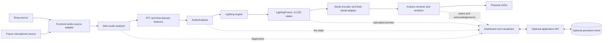

# BeatSync system architecture

Status: architecture proposal for the first browser-to-Arduino prototype. This document defines boundaries and contracts; it does not claim that any subsystem or physical hardware is working.

## End-to-end flow

Song and microphone are interchangeable source adapters. They feed one browser-local Web Audio analysis graph, then share the same lighting engine, serial protocol, Arduino firmware, and hardware output. The backend and database are an optional side branch for persistent metadata, lyrics, presets, LED configurations, settings, and later accounts. They never receive live audio or participate in LED-frame delivery.

## Module boundaries

- **Audio source adapters** own song playback or microphone permission/capture and connect a source to the browser audio graph.
- **Audio engine** owns waveform, spectrum, band, amplitude/energy, and onset features. It emits a compact `AudioAnalysis` plus optional visualization diagnostics.
- **Lighting engine** is deterministic application logic. Given analysis, configuration, and prior engine state, it produces one hardware-neutral `LightingFrame` and updated engine state.
- **Serial layer** encodes complete frames, manages Web Serial connection state, validates status messages, and applies timeouts. It does not calculate light behavior.
- **Arduino** validates messages, stores the latest LED frame, drives the selected LED driver, and reports device status. It does not run FFT or interpret audio.
- **UI and 3D presentation** subscribe to state and render it. They contain no signal processing, mapping, or packet construction.

The visual direction is the supplied dark galaxy/space scene, restrained glass panels, neon accents, animated charts, lighting controls, lyrics, player, and Arduino status. The 3D renderer is a presentation layer and must not own system state.

## Runtime states

The frontend should distinguish `disconnected`, `port-authorized`, `configuring`, `ready`, `streaming`, and `fault`. A calculated frame can be previewed without claiming that hardware received it. A device status/acknowledgement is the source for connected-device state.

## First-prototype scope

Start with one local song file, the browser analysis pipeline, three logical bands, a mapper configured for three outputs, Web Serial, an Arduino receiver, and three physical LED outputs. Keep the audio analyzer and mapper independently observable before joining the pipeline. The design should accept any supported `N`, but the first physical proof is three outputs; expand the tested mapper to 8, 20, and 50 in software before scaling hardware.

## References

- [Web Audio API `AnalyserNode`](https://developer.mozilla.org/en-US/docs/Web/API/AnalyserNode)
- [Web Serial API](https://developer.mozilla.org/en-US/docs/Web/API/Web_Serial_API)
- [Arduino UNO R4 WiFi documentation](https://docs.arduino.cc/hardware/uno-r4-wifi)
- [Arduino UNO R4 WiFi datasheet](https://docs.arduino.cc/resources/datasheets/ABX00087-datasheet.pdf)
- [BeatSync project master context](../00_PROJECT_CONTEXT/BeatSync_Project_Master_Context_v1.pdf)
