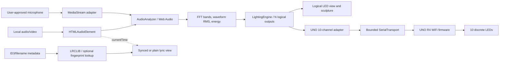

# Frontend architecture

The dashboard is dependency-free HTML/CSS/JavaScript ES modules under `frontend/`. `app.js` composes the modules and renders their state; the analysis, lighting, and transport boundaries remain independent.

## Runtime boundaries

- `LocalSongSource` owns object URLs and explicitly selects a file with `pause -> src -> load`; playback only starts from the user's player action.
- `MicrophoneSource` explicitly requests audio input, disables browser echo cancellation/noise suppression/automatic gain control, and stops all tracks on source changes.
- `AudioAnalyzer` owns one AudioContext and one cached MediaElementAudioSourceNode for the HTML audio element. The analyser and typed arrays are reused; media and microphone streams switch through the same analyser.
- `LightingEngine` accepts numeric features, timestamp, and configuration and returns exactly N byte-valued outputs plus measured-event diagnostics. It imports frequency/preset configuration only; it does not know the browser DOM, USB, Arduino pins, or service APIs.
- `Arduino10LedProfile` owns the current physical pin order and capabilities. It resamples logical N to ten values and converts four digital-only channels at threshold 128; the six PWM channels retain values 0–255.
- `SerialTransport` is user initiated and owns `requestPort`, open/close, writer lifecycle, diagnostics, and error states. It permits one `writer.write()` at a time and retains at most the newest pending frame.
- The animation-frame loop measures audio and updates the lighting engine synchronously. Serial writes are started separately at the configured cadence; the audio loop never awaits a write. UI values are sampled at a lower cadence.
- The local Node server serves the site and relays metadata lookup requests only. No audio, FFT values, lighting frame, or serial operation crosses that server.

## Frame semantics

`LightingEngine.step()` returns one logical frame. That exact frame updates the logical visualizer. `mapLogicalToPhysical()` derives the current ten-channel output from it; that mapped frame is used for physical preview and serial transmission. When output is disconnected/off, the panel says preview only. A `writer.write()` success means bytes were accepted by the browser stream; the firmware sends no acknowledgement, so the UI does not describe that as measured LED state.

The active temporary serial contract is ten comma-separated integer values `0–255`, newline terminated at 115200 baud. Default cadence is 100 ms (10 frames/second), adjustable in the UI. One latest frame may wait during a single in-progress write; newer frames replace it.

## Metadata and lyric boundary

ID3 title/artist/album fields are read locally for MP3 files; filename parsing is the fallback. LRCLIB is queried asynchronously through the same-origin local relay. Exact title/artist confidence is checked before lyrics are shown. The user can correct the title and artist or load an `.LRC`. Synced lyrics are indexed by media `currentTime`; plain lyrics are labeled unsynchronized. The 40-track catalog is metadata-only. If no match exists, the page says so. AcoustID lookup needs a configured server-only key and an injected `BeatSyncChromaprint.fingerprintFile` provider; the provider is not included.

## Validation and limits

`npm test` verifies isolated modules and serial queue behavior with fakes. It cannot verify browser decoding, user permissions, USB timing, the actual Arduino parser, or physical LEDs. Long-playback stability with serial enabled remains an open acceptance test because the earlier ~40-second pause has not been conclusively resolved. Record the 40-second, 90-second, and end-of-track observations using `integration/test-plans/README.md`.
